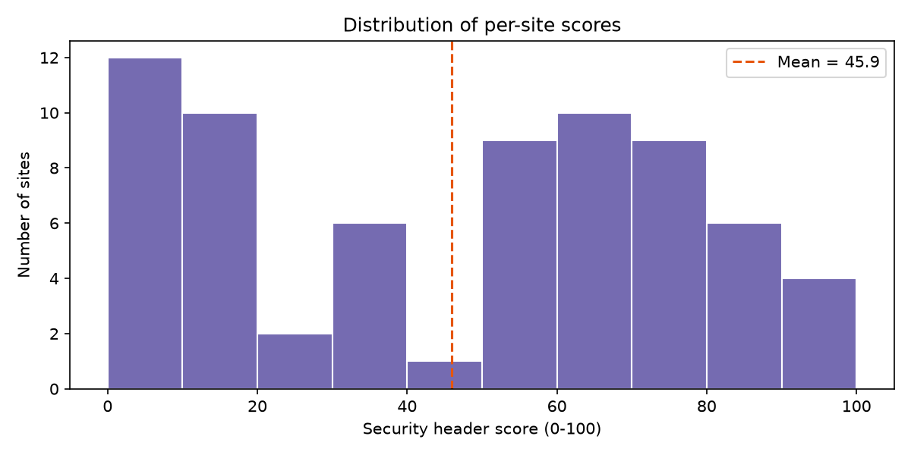

# Automated Analysis of HTTP Security Header Implementation Across Popular Websites

Research project for **Research Methodology (RM_2026-ii)**, Universidade São Tomás de
Moçambique, Faculty of Computer Science. Author: Anayo Chibuike Anyafulu.

## Headline results



Across the 66 sites reachable at scan time, the mean security header score was
**47/100**, 68.2% of sites were missing at least two of the six recommended
headers, and Mozambican sites averaged **38.2** against **52.7** for the
global comparison set. 42 of the 68 Mozambican sites were unreachable
entirely (DNS, TLS-certificate, and timeout failures — see
`results/summary.md`), which is itself a reportable finding.

This repository contains an open-source, reproducible pipeline that scans ~100 websites
(≈60 Mozambican, 40 international) across four categories (government, financial,
educational, commercial) and reports how well they implement the six recommended HTTP
security headers.

## Headers studied

| Header | Protects against |
|---|---|
| Content-Security-Policy (CSP) | Cross-site scripting (XSS), content injection |
| Strict-Transport-Security (HSTS) | Protocol downgrade, man-in-the-middle |
| X-Frame-Options | Clickjacking |
| X-Content-Type-Options | MIME-type sniffing |
| Referrer-Policy | Referrer leakage |
| Permissions-Policy | Unauthorized browser feature/API use |

## Methodology

1. **Sampling** — `sites/sites.csv` lists the sample: name, URL, category, region.
   Mozambican sites were drawn from government (.gov.mz), banking/insurance, higher
   education (.ac.mz) and major companies; the global set covers high-traffic
   international sites in the same categories for comparison.
2. **Scanning** — `scanner/scan.py` issues one HTTPS GET per site (10 s timeout,
   1 retry on transient errors, custom User-Agent, 8 concurrent workers), follows
   redirects, and records every response header to `results/raw_results.csv`.
3. **Analysis** — `scanner/analyze.py` classifies each of the six headers as
   *correct*, *present but weak* (e.g. CSP containing `unsafe-inline`, HSTS
   `max-age` below 1 year, obsolete `ALLOW-FROM`), or *missing*; computes a 0–100
   per-site score; and runs chi-square tests of independence across categories.
   Results go to `results/analysis.json`.
4. **Reporting** — `scanner/report.py` renders `results/summary.md` and four charts
   in `results/charts/`.

**Scoring:** each of the six headers contributes 1/6 of the score
(correct = full, weak = half, missing = zero).

## Reproducing

```bash
cd header-study
python3 -m venv .venv
source .venv/bin/activate
pip install -r requirements.txt

python scanner/scan.py          # ~100 sites, a few minutes
python scanner/analyze.py       # stats + hypothesis tests
python scanner/report.py        # summary.md + charts
```

Smoke-test first with `python scanner/scan.py --limit 5`.

Edit `sites/sites.csv` to add/remove sites; re-run all three steps. Scanner results
are a snapshot — record the scan date when citing numbers (the CSV stores per-site
timestamps in `scanned_at`).

## Limitations

- Only header *presence and configuration* is tested; runtime behaviour (e.g. actual
  CSP enforcement) is out of scope.
- Sites unreachable during the scan window are excluded from rates.
- The sample is a purposive snapshot, not a random sample of all .mz domains;
  findings describe the sampled sites rather than the whole population.
- Single scan date; headers change over time.

## Repository layout

```
header-study/
├── README.md            ← this file (methodology)
├── requirements.txt
├── sites/sites.csv      ← the research sample
├── scanner/
│   ├── scan.py          ← fetches headers → results/raw_results.csv
│   ├── analyze.py       ← verdicts, scores, chi-square → results/analysis.json
│   └── report.py        ← results/summary.md + results/charts/*.png
└── results/
```
