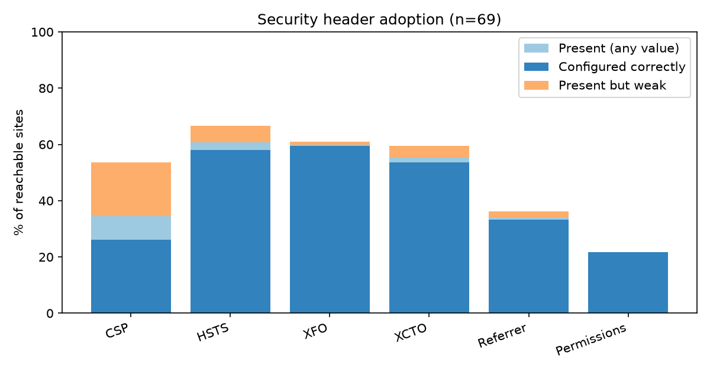
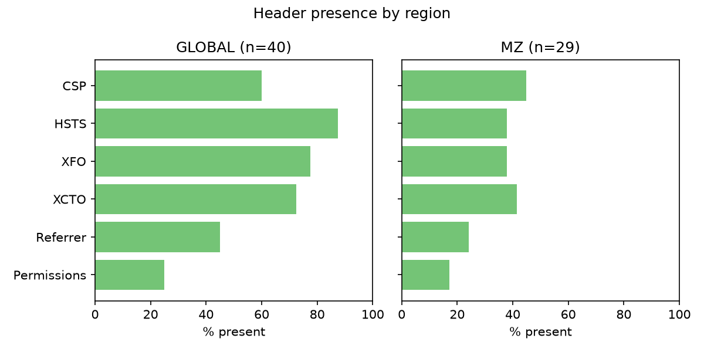
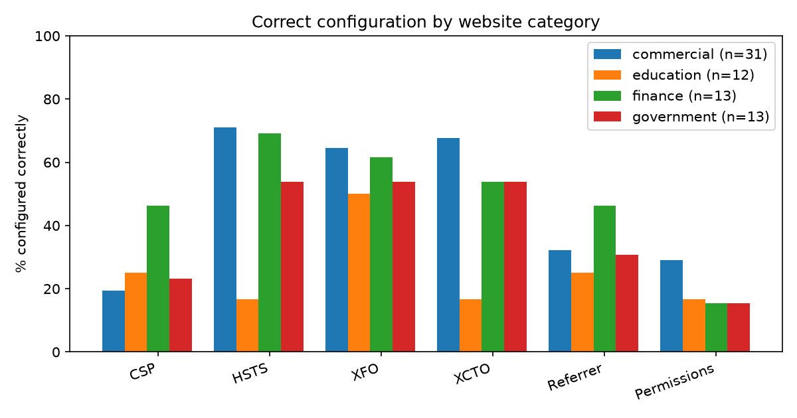

# Results — Automated Analysis of HTTP Security Header Implementation

*Automated scan of 108 sampled websites (69 reachable, 39 unreachable). Generated by `scanner/`.*

## RQ1 — What percentage of sites implement each header correctly?

| Header | Present % | Correct % | Present but weak (n) | Missing (n) |
|---|---|---|---|---|
| CSP | 53.6 | 26.1 | 19 | 32 |
| HSTS | 66.7 | 58.0 | 6 | 23 |
| XFO | 60.9 | 59.4 | 1 | 27 |
| XCTO | 59.4 | 53.6 | 4 | 28 |
| Referrer | 36.2 | 33.3 | 2 | 44 |
| Permissions | 21.7 | 21.7 | 0 | 54 |

## RQ2 — Most commonly missing or misconfigured header

Lowest presence: **Permissions**. Lowest correct-configuration rate: **Permissions**.

## RQ3 — Differences between website categories

| Category | n | Avg score | % missing ≥2 headers |
|---|---|---|---|
| commercial | 31 | 51.9 | 61.3 |
| education | 12 | 30.6 | 75.0 |
| finance | 13 | 53.2 | 61.5 |
| government | 13 | 38.5 | 76.9 |

Chi-square tests of independence (header configured correctly vs not, across categories):

| Header | χ² | dof | p | Significant (α=0.05)? |
|---|---|---|---|---|
| CSP | 3.512 | 3 | 0.3191 | no |
| HSTS | 11.319 | 3 | 0.0102 | yes |
| XFO | 0.967 | 3 | 0.8113 | no |
| XCTO | 9.076 | 3 | 0.0279 | yes |
| Referrer | 1.391 | 3 | 0.7116 | no |
| Permissions | 1.768 | 3 | 0.6262 | no |

## RQ4 — Average security header score

Mean score across reachable sites: **45.9/100**.

## Hypotheses

- **H1** (Majority of sites missing >= 2 of six headers): 66.7% of sites (46) were missing at least two headers → **supported**
- **H2** (Finance+government score higher than education+commercial): finance+government avg 45.8 vs education+commercial avg 46.0 (difference -0.2) → **not supported**
- **H3** (CSP is the most commonly missing/weak header): most missing/weak header = **Permissions** → **not supported**

## Charts

## Regional comparison

| Region | n | Avg score | % missing ≥2 headers |
|---|---|---|---|
| GLOBAL | 40 | 56.1 | 57.5 |
| MZ | 29 | 31.9 | 79.3 |

## Reachability and failure modes

39 of 108 sampled sites could not be reached during the scan window. These are externally observable defects, not scanner artifacts, and are themselves findings:

| Failure mode | n | MZ | Global | Sites |
|---|---|---|---|---|
| DNS | 26 | 26 | 0 | Ministerio da Educacao (MINEDH); Ministerio do Interior; Ministerio das Obras Publicas; UITA Mocambique; Banco Unico; Societe Generale Mocambique … (+20) |
| SSL | 9 | 9 | 0 | Ministerio da Saude (MISAU); Ministerio da Justica; Ministerio do Trabalho; Autoridade Tributaria de Mocambique; INE Mocambique; CNE Mocambique … (+3) |
| TIMEOUT | 4 | 4 | 0 | Portal do Governo de Mocambique; Fidelidade Mocambique; Old Mutual Mocambique; Tmcel |

- **DNS** — Domain does not resolve in public DNS (NXDOMAIN or lame delegation) — site is dead or only reachable via local .mz resolvers.
- **SSL** — TLS certificate fails verification (expired, self-signed, wrong hostname, or incomplete chain) — browsers warn users off, and the site cannot serve HSTS.
- **TIMEOUT** — TCP connection accepted but no HTTP response within 10 s — overloaded or misconfigured server/proxy.

DNS failures on ministry domains mean the public cannot reach those sites at all; TLS failures mean users are shown security warnings and the site cannot deploy HSTS; timeouts suggest capacity or proxy misconfiguration. All three failure modes directly depress the header scores of the affected sites and help explain the MZ–global gap.

## Reproducibility note

- **Scan date:** 2026-09-28 (UTC). Exact per-site timestamps are in `results/raw_results.csv`.
- **Network location:** GitHub Actions runner (scheduled re-scan).
- **Reachability:** 69/108 sites reachable; 39 unreachable (classified by failure mode in the section above).
- Header configurations change over time; re-running `scan.py → analyze.py → report.py` refreshes this snapshot and makes the study reproducible from any network.
