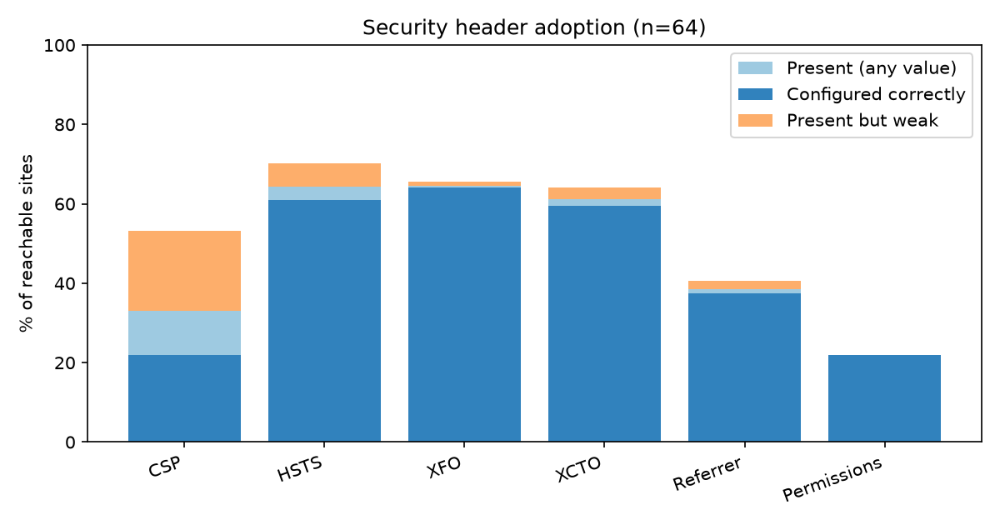
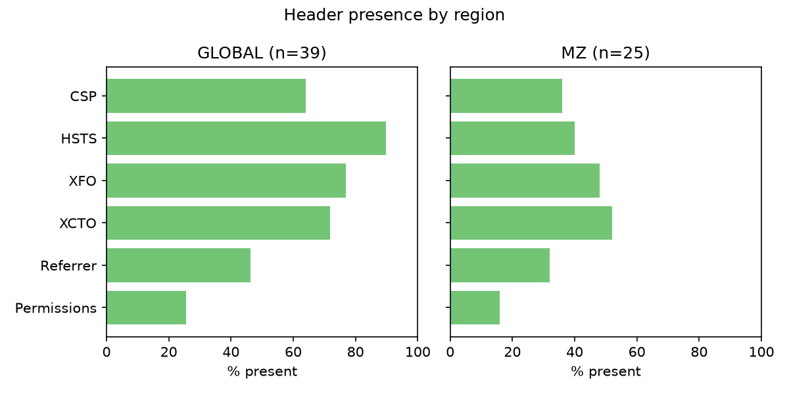
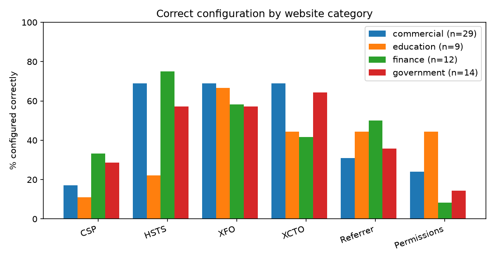
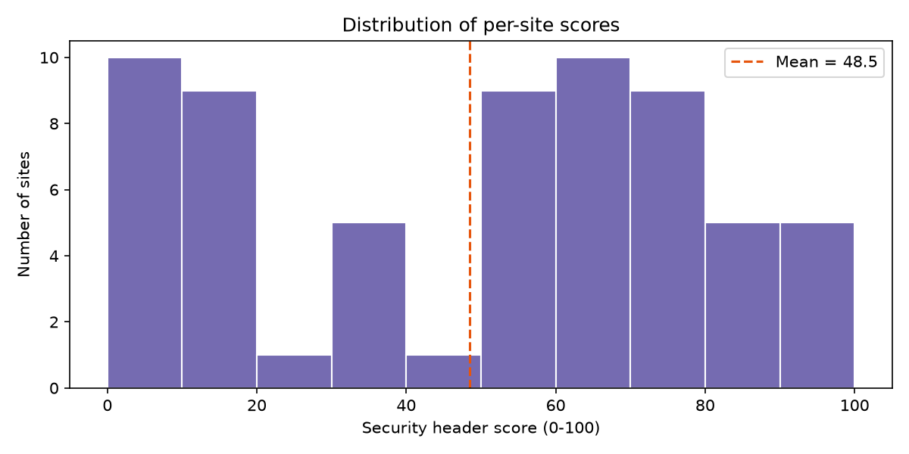

# Results — Automated Analysis of HTTP Security Header Implementation

*Automated scan of 108 sampled websites (64 reachable, 44 unreachable). Generated by `scanner/`.*

## RQ1 — What percentage of sites implement each header correctly?

| Header | Present % | Correct % | Present but weak (n) | Missing (n) |
|---|---|---|---|---|
| CSP | 53.1 | 21.9 | 20 | 30 |
| HSTS | 70.3 | 60.9 | 6 | 19 |
| XFO | 65.6 | 64.1 | 1 | 22 |
| XCTO | 64.1 | 59.4 | 3 | 23 |
| Referrer | 40.6 | 37.5 | 2 | 38 |
| Permissions | 21.9 | 21.9 | 0 | 50 |

## RQ2 — Most commonly missing or misconfigured header

Lowest presence: **Permissions**. Lowest correct-configuration rate: **CSP**.

## RQ3 — Differences between website categories

| Category | n | Avg score | % missing ≥2 headers |
|---|---|---|---|
| commercial | 29 | 51.5 | 62.1 |
| education | 9 | 46.3 | 55.6 |
| finance | 12 | 49.3 | 58.3 |
| government | 14 | 42.9 | 78.6 |

Chi-square tests of independence (header configured correctly vs not, across categories):

| Header | χ² | dof | p | Significant (α=0.05)? |
|---|---|---|---|---|
| CSP | 2.264 | 3 | 0.5227 | no |
| HSTS | 7.534 | 3 | 0.0557 | no |
| XFO | 0.792 | 3 | 0.8521 | no |
| XCTO | 3.638 | 3 | 0.303 | no |
| Referrer | 1.521 | 3 | 0.6815 | no |
| Permissions | 4.529 | 3 | 0.2081 | no |

## RQ4 — Average security header score

Mean score across reachable sites: **48.5/100**.

## Hypotheses

- **H1** (Majority of sites missing >= 2 of six headers): 64.1% of sites (41) were missing at least two headers → **supported**
- **H2** (Finance+government score higher than education+commercial): finance+government avg 45.8 vs education+commercial avg 50.3 (difference -4.5) → **not supported**
- **H3** (CSP is the most commonly missing/weak header): most missing/weak header = **CSP** → **supported**

## Charts

## Regional comparison

| Region | n | Avg score | % missing ≥2 headers |
|---|---|---|---|
| GLOBAL | 39 | 57.1 | 53.8 |
| MZ | 25 | 35.0 | 80.0 |

## Reachability and failure modes

44 of 108 sampled sites could not be reached during the scan window. These are externally observable defects, not scanner artifacts, and are themselves findings:

| Failure mode | n | MZ | Global | Sites |
|---|---|---|---|---|
| DNS | 26 | 26 | 0 | Ministerio da Educacao (MINEDH); Ministerio do Interior; Ministerio das Obras Publicas; UITA Mocambique; Banco Unico; Societe Generale Mocambique … (+20) |
| SSL | 9 | 9 | 0 | Ministerio da Saude (MISAU); Ministerio da Justica; INE Mocambique; CNE Mocambique; Banco Internacional de Mocambique; Old Mutual Mocambique … (+3) |
| TIMEOUT | 8 | 7 | 1 | Portal do Governo de Mocambique; Ministerio do Trabalho; Fidelidade Mocambique; Universidade Catolica de Mocambique; Universidade Sao Tomas de Mocambique; Petromoc … (+2) |
| REFUSED | 1 | 1 | 0 | Banco Comercial e de Investimentos |

- **DNS** — Domain does not resolve in public DNS (NXDOMAIN or lame delegation) — site is dead or only reachable via local .mz resolvers.
- **SSL** — TLS certificate fails verification (expired, self-signed, wrong hostname, or incomplete chain) — browsers warn users off, and the site cannot serve HSTS.
- **TIMEOUT** — TCP connection accepted but no HTTP response within 10 s — overloaded or misconfigured server/proxy.
- **REFUSED** — Server actively refused the connection.

DNS failures on ministry domains mean the public cannot reach those sites at all; TLS failures mean users are shown security warnings and the site cannot deploy HSTS; timeouts suggest capacity or proxy misconfiguration. All three failure modes directly depress the header scores of the affected sites and help explain the MZ–global gap.

## Reproducibility note

- **Scan date:** 2026-11-23 (UTC). Exact per-site timestamps are in `results/raw_results.csv`.
- **Network location:** GitHub Actions runner (scheduled re-scan).
- **Reachability:** 64/108 sites reachable; 44 unreachable (classified by failure mode in the section above).
- Header configurations change over time; re-running `scan.py → analyze.py → report.py` refreshes this snapshot and makes the study reproducible from any network.
